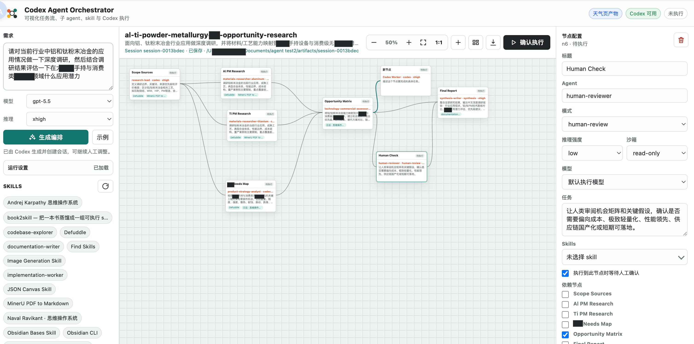

# Agent Workflow Design and Execution Platform

中文名称：Agent 工作流设计与执行平台

[English README](./README.en.md)

一个本地可运行的可视化 agent 编排系统：用户输入需求后，后端调用本机可用的编程工具（Codex 或 Claude Code）生成 DAG 任务流；用户在页面里拖动、编辑、增删节点和依赖；确认后由运行器按依赖执行节点，遇到人工确认节点会暂停等待。

## 效果图



## Run

```bash
npm start
```

打开 <http://localhost:8787>。

如果只想体验界面和编排，不想消耗真实工具调用：

```bash
USE_MOCK_CODEX=1 npm start
```

## Test

```bash
npm test
```

## 2026-05-19 更新

- 会话命名与产物记录：生成编排时自动归纳对话名称，用户可在画布顶部直接修改；产物目录会生成 `对话命名.md`，记录当前对话名称、原始需求、会话路径和产物路径，并在用户更名后同步更新。
- 产物快捷操作：过程产物和结果产物支持在页面内一键打开，也支持一键打开所在文件夹。
- 执行窗口优化：底部命令提示符/运行日志窗口已放大，便于查看 Codex 或 Claude Code 的 stdout、stderr 和执行事件。
- 输出物要求修复：结果汇总节点选择 PPT、HTML、表格、图片、PDF、Word 文档等类型时，前端提示词和后端执行 prompt 都会以用户选中的输出类型为准，不再被残留的 Markdown 默认文案覆盖。
- Windows 兼容性：路径配置保留 `C:\...` 盘符，原生文件夹选择和本机 CLI 启动路径做了 macOS/Windows 兼容处理。

## Development History

历史开发脉络见 [`DEVELOPMENT_HISTORY.md`](./DEVELOPMENT_HISTORY.md)。Git 操作规则保存在本地 `GIT_WORKFLOW_RULES.md`，该文件按项目约定不纳入仓库。

## What It Does

- `GET /api/health`：扫描本机可用编程工具，当前支持 `codex` 与 `claude`。
- `GET /api/config` / `PUT /api/config`：读取和保存 `orchestrator.config.json`，配置编程工具、项目文件夹、会话记录目录、产物目录、默认模型和推理强度。
- `POST /api/plan`：调用当前选择的编程工具，用 `schemas/orchestration-plan.schema.json` 约束输出，生成可编辑编排；可传 `toolProvider`、`model` 与 `reasoningEffort` 控制规划工具、模型和推理强度。
- `PUT /api/sessions/:id/plan`：保存人工调整后的当前编排到 session。
- `PUT /api/sessions/:id/title`：保存用户自定义对话名称。创建 session 时会先按用户输入目标自动归纳一个名称。
- `POST /api/open-path`：打开工作区、记录目录或产物目录内的文件，也可打开所在文件夹。
- `POST /api/runs`：创建运行，按 DAG 依赖自动调度节点。
- `GET /api/runs/:id/events`：通过 SSE 推送节点状态、日志和最终结果。
- `POST /api/runs/:id/nodes/:nodeId/continue`：人工确认节点继续执行；也用于确认“需要时确认”的联网请求，确认后该节点会以联网高权限模式重跑。
- `POST /api/runs/:id/stop`：停止运行并取消活跃工具子进程。
- `GET /api/weather?city=...`：天气查询示例产物的后端代理，使用 Open-Meteo，无需密钥。

## Design Notes

Agent View 的核心不是“聊天窗口变多”，而是把多个后台 agent 的状态、输入需求和生命周期集中到一个可操作视图里。本实现把这些能力落到 Web UI：

- 状态总览：每个节点显示 pending/running/waiting/completed/failed。
- Startup tool choice：应用启动后扫描本机 `codex` 与 `claude`，首次使用时让用户选择编程工具；之后可在运行设置中切换。
- Peek：底部运行日志持续显示编程工具 stdout/stderr 和事件。
- Human-in-the-loop：`human-review` 或 `requiresReview` 节点暂停，用户点击时间线继续。
- Network-in-the-loop：生成前可选择默认联网策略，每个节点也可单独切换“完全联网（高权限）”或“需要联网时找用户确认”；后者会在节点发现联网需求时暂停，用户确认后再继续。
- Skill policy：自动编排只把人物视角、书籍框架、经验方法论等特色 skill 放入节点配置；`defuddle`、`mineru-pdf2md`、文档/表格/浏览器等通用 skill 留给执行时由节点执行工具自主调用。节点配置里的 skill 是必用项，并且会按当前编程工具隔离来源：Codex 只展示 Codex 可见 skill，Claude Code 只展示 Claude Code 可见 skill。
- Dispatch：确认执行后，后端按 DAG 调度多个 agent 节点，支持有限并发。
- Editing safety：节点增删/插入、拖拽、依赖、任务和 skill 修改支持工具栏撤回；画布空白处支持左键拖动整体移动节点布局，`Shift + 拖动` 保留为框选，`Cmd/Ctrl+Z` 可撤回。
- Conversation title：每次生成编排会自动创建一个对话名称，用户可在画布顶部显眼位置直接修改并保存。
- Session artifact：每次生成编排会创建 `.orchestrator/sessions/<session-id>/`，包含 conversation、plan、当前编辑后的 plan、每次运行的 prompt/output/summary。真正面向用户的可交付产物写入 `artifacts/<session-id>/`；其中会自动生成 `对话命名.md` 记录当前对话名称、原始需求和相关路径，用户改名后会同步更新。过程产物和结果产物可在页面中一键打开或打开所在文件夹。

## Workspace, Sessions, And Artifacts

默认配置在 `orchestrator.config.json`：

```json
{
  "workspaceRoot": ".",
  "storageRoot": ".orchestrator",
  "artifactRoot": "artifacts",
  "toolProvider": "codex",
  "toolProviderConfirmed": false,
  "models": {
    "planner": "gpt-5.3-codex",
    "executor": "gpt-5.3-codex",
    "reasoningEffort": "medium"
  },
  "codex": {
    "adapter": "cli"
  },
  "claude": {
    "adapter": "cli"
  }
}
```

- `toolProvider`：当前使用的编程工具，支持 `codex` 与 `claude`。
- `toolProviderConfirmed`：用户是否已在启动选择窗口中确认过工具。
- `workspaceRoot`：编程工具执行所在项目文件夹。相对路径会按本工具根目录解析。
- `storageRoot`：系统记录目录，相对 `workspaceRoot` 解析。默认 `.orchestrator`。
- `artifactRoot`：用户可交付产物目录，相对 `workspaceRoot` 解析。默认 `artifacts`。
- `models.planner`：生成编排时默认使用的模型。
- `models.executor`：节点执行时默认使用的模型；节点配置里的模型会覆盖它。
- `models.reasoningEffort`：默认推理强度；左侧和节点级配置都可以覆盖。

目录结构：

```text
项目根目录/
  orchestrator.config.json
  .orchestrator/
    sessions/
      <session-id>/
        metadata.json
        conversation.jsonl
        plan.json
        plan.current.json
        runs/
          <run-id>/
            plan.json
            <node-id>.prompt.md
            <node-id>.last-message.md
            <node-id>.md
            summary.md
  artifacts/
    <session-id>/
      manifest.json
      对话命名.md
      ...
```

页面左侧“运行设置”可以直接修改工具、路径和默认模型。目录项旁边的“选择”按钮会在 macOS 和 Windows 上弹出原生文件夹选择窗口，选完后点击“保存设置”生效；输入框保留为手动兜底。为了让 `workspace-write` 节点能写入产物，建议 `artifactRoot` 保持在 `workspaceRoot` 内。

## Tool Integration

Codex 计划生成使用只读沙箱：

```bash
codex exec --skip-git-repo-check --sandbox read-only --output-schema schemas/orchestration-plan.schema.json -
```

Claude Code 计划生成使用非交互 print 模式，并把 schema 通过 `--json-schema` 传入：

```bash
claude --print --input-format text --output-format text --json-schema '<schema-json>'
```

Skill 发现与当前 provider 绑定：选择 Codex 时扫描 `~/.codex/skills`、`~/.agents/skills` 和 Codex 插件缓存；选择 Claude Code 时扫描 `~/.claude/skills`、项目 `.claude/skills` 和 Claude 插件目录。切换编程工具会重新加载 skill 下拉列表，规划阶段不会把另一个 provider 的 skill 混入节点配置。

节点执行使用计划中的 `sandbox`，默认 `workspace-write`。执行器会使用短生命周期工具会话、折叠插件同步噪声日志，并在最终输出稳定后推进到下一节点，避免页面长时间看起来无响应。
节点也可单独配置 `model` 与 `reasoningEffort`，适合把简单检查设为 `low/medium`，把复杂实现设为更高 effort；左侧“推理”会传入计划生成，右侧节点配置可逐项调整执行推理强度。Claude Code 的 effort 选项会按当前模型动态收敛：Sonnet 显示 `low/medium/high/max`，Opus 4.7 显示 `low/medium/high/xhigh/max`，不声明支持 effort 的模型不会展示可选推理强度。执行过程气泡会根据当前画布可视区域自动选择位置并在必要时轻微滚动画布，确保用户能看到当前步骤的关键进展。
当节点模式选择为“结果汇总 / Synthesis”时，右侧配置面板会出现“输出物要求”：可从 PPT、HTML、MD 文档、表格、图片、PDF、Word 文档和其他类型中选择，并补充人工说明。该要求会进入最终汇总节点的执行 prompt，用于约束最终答案和需要落盘的用户产物。
当节点模式选择为“自动评审 / Auto Review”时，右侧配置面板会出现自动评审策略：可设置最大迭代次数、返工目标节点、评审标准和达到上限后是否继续推进。执行时该节点会读取上游输出并返回 `pass`、`iterate` 或 `capped` 判定；在未达到上限时会把返工说明打回目标节点重新运行，达到上限后保留问题建议并继续下游，避免死循环。
当前模型接入方式是本机 CLI：Codex 调用 `codex exec -m <model> -c model_reasoning_effort="<effort>"`，Claude Code 调用 `claude -p --model <model> --effort <effort>`。网页不会保存 API Key；鉴权、账号和模型可用性由本机工具环境负责。Windows 环境下会保留 `C:\...` 盘符路径，并用 shell 兼容方式启动本机 CLI，避免 npm 安装的 `.cmd` 命令无法检测或执行。

## Project Layout

- `server/index.js`：HTTP API 与静态资源服务。
- `server/planner.js`：计划归一化、fallback 草案、provider planner 调用。
- `server/runner.js`：DAG 调度、人工确认、SSE 事件、运行产物。
- `server/codexRunner.js`：Codex / Claude Code provider 探测与子进程封装。
- `public/app.js`：前端状态管理、拖拽画布、节点编辑、执行面板。
- `public/style.css`：无依赖的应用样式。
- `public/weather.html` / `public/weather.js`：用于验证“生成并执行天气查询网页”需求的示例交付页。
- `schemas/orchestration-plan.schema.json`：AI 计划输出约束。

## References

- Anthropic: [Agent view in Claude Code](https://claude.com/blog/agent-view-in-claude-code)
- Claude Code Docs: [Manage multiple agents with agent view](https://code.claude.com/docs/en/agent-view)
- Claude Code Docs: [Run agents in parallel](https://code.claude.com/docs/en/agents)
- Claude Code Docs: [Create custom subagents](https://code.claude.com/docs/en/sub-agents)
- Claude Docs: [Agent Skills](https://docs.claude.com/en/docs/claude-code/skills)
